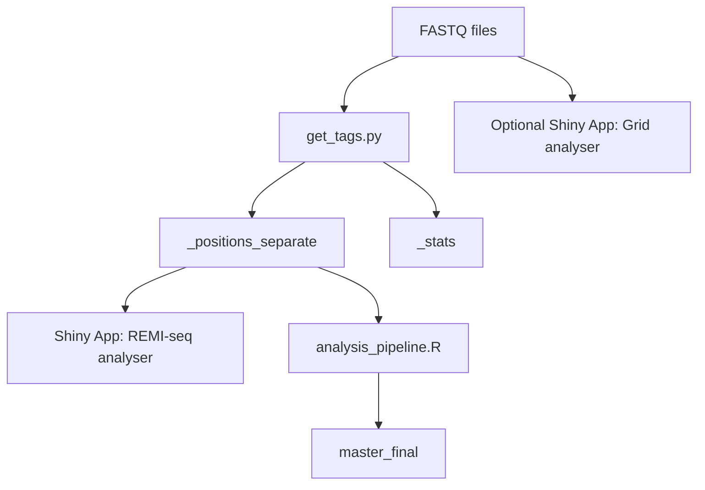
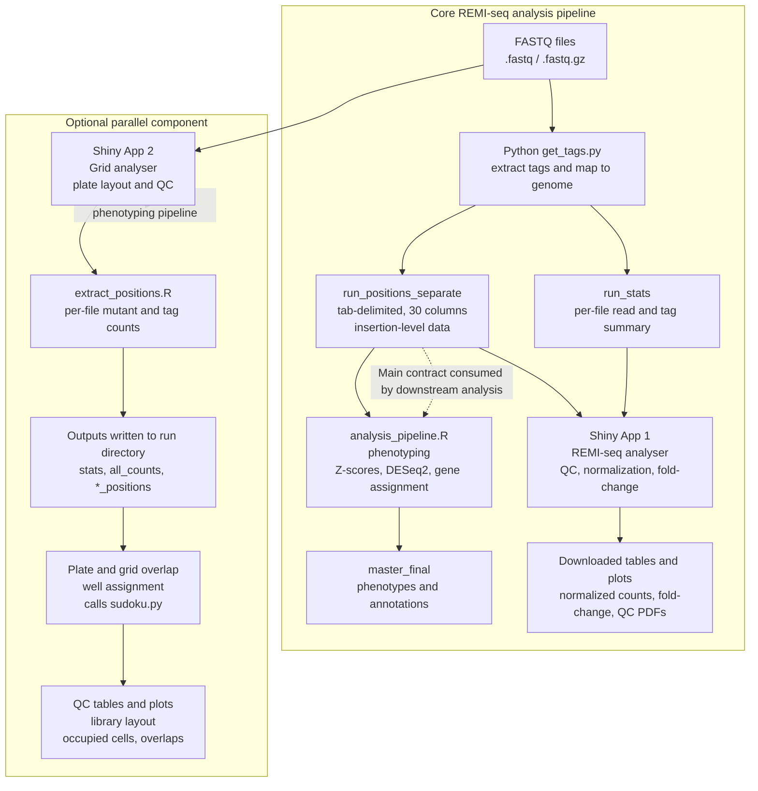

**REMI-seq Software Pipeline**

Overview

This repository contains software components for the analysis of REMI-seq insertional mutagenesis screens. The pipeline processes raw sequencing data (FASTQ files) to identify genomic insertion sites, quantify mutant abundances, perform quality control, and assign biological phenotypes to mutants.

The software consists of:

- A core analysis pipeline (Python + R + Shiny)

- An optional grid-based QC Shiny app for plate and layout validation

The pipeline was developed for a specific laboratory environment and dataset. It is functional and scientifically validated, but not fully generalized. This README documents the actual data flow, file formats, and component boundaries used by the code.

High-Level Pipeline

Quick Start

This section describes the minimum steps required to go from raw sequencing data to a final phenotype table. A more in depth flow chart is available at the bottom of this document. 

Prerequisites

- Python 3

- R (with RStudio recommended for interactive use)

Required R packages:

- shiny, tidyverse, data.table, GGally, gtools, DESeq2

- Large input data (FASTQ files) available locally

Step 1: Prepare Inputs

Ensure you have:

- FASTQ files (.fastq or .fastq.gz) in a single directory

- An experimental design file (sample names, replicates, filenames)

- Annotation files:

  - Genomic insertion lookup table

  - Vector index definitions

Step 2: Extract Tags and Insertion Positions

Run the Python preprocessing step to extract insertion tags and map them to the genome:

python get_tags.py \
  -files path/to/fastq_directory \
  -annot path/to/annotated_positions_file \
  -indices path/to/indices_file \
  -cutoff 0
This produces two key output files in the run directory:

<run>_positions_separate

<run>_stats

**These files form the core data contract for all downstream analysis.**

Step 3: QC and Normalization (Shiny App)

Launch the REMI-seq analyser Shiny app:
shiny::runApp()

Within the app:

- Load the experimental design file

- Load <run>_positions_separate / <run>_stats

- Perform QC (replicate correlations)

- Generate normalized count tables and fold-change plots

- Download tables as needed

This step is intended for interactive quality control and exploration.

Step 4: Phenotyping and Final Analysis

Run the downstream analysis script:
source("analysis_pipeline.R")

This script:

- Assigns phenotypes using Z-score and DESeq2 approaches

- Annotates insertions with gene information

- Produces a final in-memory data frame (master_final)

- Export or further analyze this object as needed.

Core Pipeline Components
1. Raw Input Data

Inputs

- FASTQ files (.fastq / .fastq.gz)

- Experimental design file

- Genome annotation and index files

These inputs are large and not bundled with the repository.

2. Tag Extraction and Position Mapping (Python)

- Script

- get_tags.py

Purpose

- Extract insertion tags from FASTQ files

- Match tags to genomic insertion sites

Outputs

- <run>_positions_separate: insertion-level data (main downstream input)

- <run>_stats: per-file read and tag statistics

➡️ Important:
<run>_positions_separate is the primary file format relied upon by downstream R analyses.

3. REMI-seq Analyser Shiny App

Purpose

- Interactive QC

- Normalization of read counts

- Aggregation by insertion site or gene

- Fold-change calculation

Role in pipeline

- Exploratory and QC-focused

- Not responsible for final phenotype calls

4. Downstream Analysis Pipeline (R)

Script

- analysis_pipeline.R

Purpose

- Assign biological phenotypes

- Perform statistical analysis beyond the Shiny app

Methods

- Z-score–based phenotyping

- DESeq2 differential analysis

- Gene and promoter-region assignment

Output

- master_final: final phenotype and annotation table

This script is structured as a worked analysis example, not a parameterized workflow.

Optional Component: Grid / Plate QC Shiny App
Grid Analyser Shiny App

Purpose

- Plate and grid layout validation

- Mutant overlap and well-level QC

Key characteristics

- Reads FASTQ or precomputed position files directly

- Produces its own stats and all_counts outputs

- Focused on wet-lab QC rather than downstream analysis

- Relationship to core pipeline

*Runs in parallel*

Not required for standard REMI-seq phenotyping

Does not feed into analysis_pipeline.R

Scope and Limitations

This pipeline is:

- Scientifically validated

- Suitable for reproducing internal or published analyses

- Well suited for interactive QC and exploratory analysis

This pipeline is *not*:

- Fully automated

- Fully generalized

- A single unified application

Known limitations include hard-coded paths, limited input validation, and reliance on positional column indexing.

Notes for Developers

If extending or refactoring this pipeline, the most critical interface to preserve is:

- The schema and semantics of <run>_positions_separate

- All downstream components depend on this file format.

